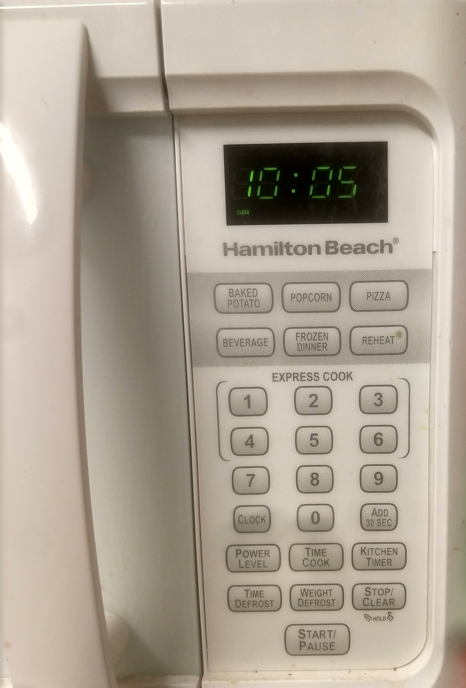

# Human Computer Interaction - Project 1

## Lakshmi Sampath Pagolu

I am using my home microwave oven for this project.

### Problems with my microwave
- Buttons
- Display
- Stop/Clear Button
- Power level

#### Buttons

__Common usage__: Buttons are the most used feature on a Microwave.

My microwave has 25 buttons in total. Each and every button when pressed plays a beep as sound feedback to the user. More options equals more complexity. Keeping that aside, the major flaw in my Microwave's design is Buttons are very hard to press.

My microwave always displays the wrong time, I could change it to show correct the time and I have tried, gave up halfway because my finger started to hurt.

__Common sequence 1__: I am hungry and I want to cook some rice for myself. I have to cook the rice in Microwave oven for approximately 20 minutes. This time varies according to the quantity of rice I am cooking. For suppose one day I am cooking extra rice, I have to put in more time. If I make a mistake in entering the time I have to start again. If I put less time, I can add more time by clicking on "add 30 sec" button. What if I want to add 5 minutes, I have to click 10 times to add 5 minutes.

__Solution__:
- Replace the buttons with something more tactile. Buttons which are clickable are more comfortable, they also provide a haptic feedback that can be super helpful.
- Remove the buttons entirely for setting and time introduce a dial for easy setting of the time.

#### Display

My Microwave has a tiny display, that is good enough to set the time, see the remaining time or check the time of the day.

__Common sequence 2__:  I am very stressed due to a project submission and I want to drink some tea. I go to the kitchen to heat the water for my tea I pour water into cup and put it in the Microwave oven and start cooking by pressing down on one of the express cook options. It beeps twice, telling me that timer is already set for something else.

First image is when timer is set. Second Image is Time of the day.

When I check the display, I see in very tiny letters saying cook. Now I have to click start/stop button or reset it and give a new time. This seemingly small clicks to heat my water is very annoying. Even though there is some indication that time of the day is being displayed like ':' is blinking which is hardly noticeable at a single glance.

__Solution__: Add different colored LEDs to give the user feedback on what is being displayed at the moment. A red LED can be used to display the timer like in the image below. Now a days LEDs can show multiple colors according to the voltage fed to them. If those LEDs are used, different colors can be displayed.

Alternatively, a new feature can be added to the microwave. If cooking stops in the middle, the timer should reset after a certain period of time. There is no use in preserving the remaining cooking time hours after the timer is stopped in the middle.
